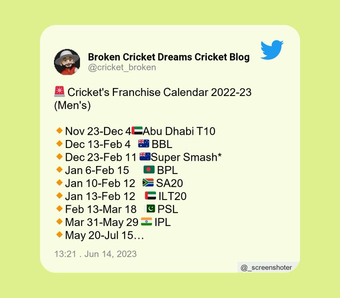
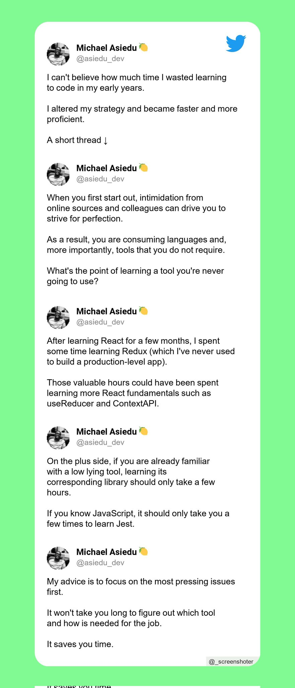
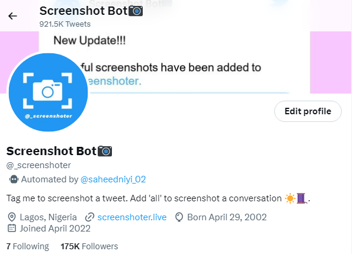

# -_screenshoter

# Source code for @_screenshoter.

@_screenshoter is a twitter bot that helps to create beautiful screenshots of tweets and long twitter threads using python's Imaging library and the twitter API.

Examples of such screenshots are

The bot gained massive usage and moved from **0 to 175 thousand followers** and created about **920 thousand screenshots from april 19th 2022 to june 15th 2023!**

Also, a [website](https://screenshoter.herokuapp.com/) was created to support the bot (since it constantly hits twitter limit of 2,400 tweets per day) and allows twitter users to download tweets from the tweet link. **The [website](https://screenshoter.herokuapp.com/) original domain name (screenshoter.live) averaged 700 image downloads per day** from april 23rd 2022 to june 15th 2023.

The [bot](https://twitter.com/_screenshoter) is **no longer active though** because of the new restrictions placed by twitter on their API.
